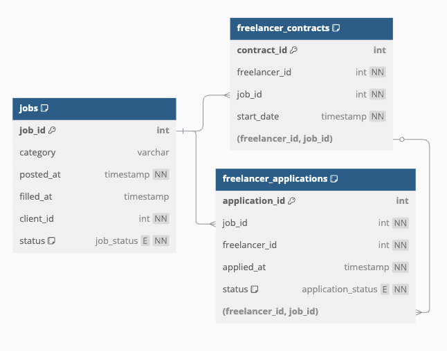

# goLance Challenge for Data Analytics
Submitted by: Aluizio Cidral Junior



The diagram above represents the core database structure, including tables for jobs, freelancer applications, and contracts. It defines key relationships and constraints that are essential for understanding how data is organized within the platform. The tables track job postings, freelancer applications, and contracts with relevant status and timestamps.


Below is the completed challenge with consistent explanations and code blocks. 

---
---

## Task 1: Define Key Metrics

- List at least 3 key metrics that measure freelancer engagement and job fulfillment efficiency.
- Explain why each metric is important and how it helps improve goLance`s plataform.

---

### Average Time to First Application

**What it measures:** The average or median time between when a job is posted (`jobs.posted_at`) and when the first application is submitted (`freelancer_applications.applied_at`) for that job.

**Why it matters:** This metric reflects how quickly freelancers are engaging with new job postings. A shorter time indicates high freelancer activity and effective job visibility, while longer times may suggest issues with notifications or freelancer inactivity.

**How it helps:** By identifying delays in application responses, goLance can optimize job posting strategies, such as improving notification systems, adjusting posting times, or enhancing job visibility to ensure freelancers are promptly alerted to new opportunities.

---

### Freelancer Application Acceptance Rate

**What it measures:** The percentage of applications submitted by a freelancer that are accepted (`application_status = 'accepted'`) out of their total applications.

**Why it matters:** This metric highlights freelancers' success in securing jobs. A low acceptance rate may indicate mismatched skills, poor proposal quality, or overly competitive job categories.

**How it helps:** By analyzing acceptance rates, goLance can provide targeted support to freelancers, such as resume coaching, proposal writing tips, or AI-driven job recommendations to better match freelancers with suitable opportunities.

---

### Job Time-to-Fill

**What it measures:** The average time between when a job is posted (`jobs.posted_at`) and when it is marked as filled (`jobs.filled_at`).

**Why it matters:** This metric directly measures the efficiency of the platform in matching jobs with freelancers. Shorter fill times indicate a healthy and responsive marketplace.

**How it helps:** If fill times are long, goLance can investigate and address potential issues, such as improving job categorization, boosting job visibility, or incentivizing freelancers to apply.

---

### Application-to-Hire Conversion Ratio

**What it measures:** The ratio of filled jobs to the total number of applications submitted for those jobs.

**Why it matters:** A low ratio suggests that clients are struggling to find suitable freelancers despite receiving many applications, indicating potential mismatches or inefficiencies in the hiring process.

**How it helps:** By improving job descriptions, adding skill validation for applicants, or refining client filtering tools, goLance can enhance the quality of matches and streamline the hiring process.

---
---

## Task 2: Write SQL Queries

1. Median time to fill a job(from `posted_at` to `filled_at`) for each job category

2. Job application conversion rate, calculated as: 

> Conversion Rate = (Accepted Applications / Total Applications) * 100
  
3. Top 3 job categories with the lowest fulfillment rate, where the fulfillment rate is:

> Fulfillment Rate = (Filled Jobs / Total Jobs in Category) * 100

### 1. Median Time to Fill a Job for Each Job Category

```sql
select 
    
    category,
    median(filled_at - posted_at) as median_fill_time

from jobs

where status = 'filled'
group by category
order by category
```

---

### 2. Job Application Conversion Rate

```sql
select
    
    job_id,
    round(
        100 * sum(case when status = 'accepted' then 1 else 0 end) / count(*), 2
    ) as conversion_rate

from freelancer_applications
group by job_id
```

---

### 3. Top 3 Job Categories with the Lowest Fulfillment Rate

```sql
select

  category,
  round(100.0 * sum(case when status = 'filled' then 1 else 0 end) / count(*)) as fulfillment_rate

from jobs
group by category
order by fulfillment_rate asc
limit 3
```

---
---

## Task 3: Analyze and Recommend

Based on your SQL results, identify trends, inefficiencies, and areas of improvement.

- Answer the following:
    1. What factors may contribute to slow job fulfillment times?
    2. If some job categories have a significantly lower fulfillment rate, what possible  actions can goLance take?
    3. If freelancer applications have a low conversion rate, what strategies could  improve engagement?

- Provide a concise summary of your insights and recommendations

>### Context from a Similar Marketplace Experience
>
>In a previous role at a startup that served as a marketplace for home maintenance services (e.g., plumbing, electrical) in the B2B channel, we encountered similar challenges with supply-demand mismatches, slow fulfillment, and provider quality. Key strategies included:
>
>- **Proactive Recruitment:** Sourcing skilled providers from external databases and inviting them to join.  
>- **Elite Tier:** Rewarding top performers with priority access to new requests to maintain high-quality standards and incentivize better performance.
>
>### How This Connects to goLance
>
>- **Recruiting Skilled Freelancers:** Proactive identification and outreach to qualified freelancers in underserved skill areas or regions can help fill supply gaps.  
>- **Rewarding Top Talent:** Implement an “elite” or “top-rated” tier giving high-performing freelancers priority visibility or faster access to premium jobs.

---

### 1. Factors Contributing to Slow Job Fulfillment Times

- **Poor Job Visibility:** Jobs not prominently displayed or lacking effective notifications delay freelancer awareness.  
- **Mismatched Skills:** Jobs requiring niche skills that few freelancers possess.  
- **Inefficient Matching:** Algorithms that do not effectively pair freelancer skills with job requirements.  
- **Freelancer Inactivity:** Some categories may have too few active freelancers.  
- **Unattractive Job Postings:** If job descriptions or compensation are weak, freelancers are less likely to apply.

---

### 2. Actions for Job Categories with Low Fulfillment Rates

- **Identify Supply Gaps:** If freelancers with specific skill sets are scarce, proactively recruit them.  
  - *Reference to Previous Experience:* Similar to leveraging external databases for home maintenance providers, goLance can use external sources or targeted outreach to find freelancers in specific categories.  
- **Improve Job Descriptions:** Encourage clients to create clear, detailed, and attractive job postings.  
- **Promote Underserved Categories:** Launch marketing or email campaigns aimed at attracting freelancers to underrepresented categories.

---

### 3. Strategies to Improve Freelancer Application Conversion Rates

- **AI-Driven Job Matching:** Recommend jobs that match freelancers’ skills and experience to reduce irrelevant applications.  
- **Incentivize Quality Applications:** Recognize freelancers who consistently submit high-quality proposals, possibly by offering priority in search results.  
  - *Reference to Previous Experience:* Similar to an “elite tier” for top-performing service providers, goLance can grant “top-rated” status to freelancers who meet certain performance criteria.  
- **Client Filtering Tools:** Help clients refine search criteria to reduce the volume of unsuitable applications.  
- **Freelancer Skill Development:** Provide workshops and tutorials on proposal writing and skill enhancement.

---

## Summary of Insights and Recommendations

### Insights

- **Slow job fulfillment times** often stem from visibility issues, skill mismatches, or freelancer inactivity.  
- **Low fulfillment rates** in certain categories can highlight supply-demand imbalances or unattractive job offerings.  
- **Low application conversion rates** can indicate mismatches in freelancer skills, poor proposal quality, or too many irrelevant applications.

### Recommendations

- **Optimize Job Visibility:** Enhance notifications, highlight urgent or high-value jobs, and ensure freelancers see new postings quickly.  
- **Enhance Matching Algorithms:** Implement AI-driven matching to align freelancer skills with client needs.  
- **Improve Job Descriptions:** Collaborate with clients to craft detailed, compelling postings.  
- **Address Supply Gaps:** Actively recruit or train freelancers in high-demand, low-supply categories.  
- **Reward Top Performers:** Introduce an “elite” or “top-rated” status that incentivizes freelancers to maintain high-quality standards.

By implementing these strategies, goLance can improve freelancer engagement, reduce job fulfillment times, and create a more efficient and satisfying platform for both freelancers and clients.
